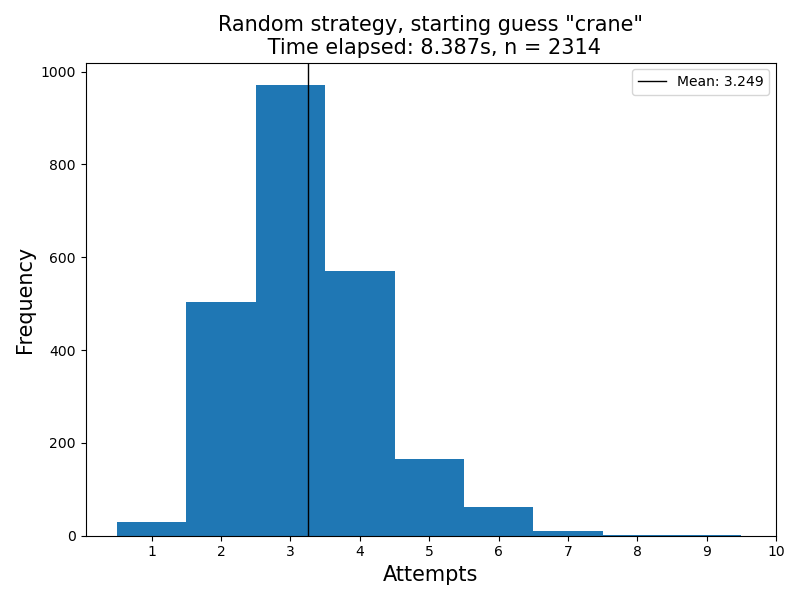

# C++ Wordle Solver

Basic Wordle solver that uses some information theory to try to optimise the number of guesses required. Currently supports only a simple command-line interface. Work in progress.

## Usage
Compilation:

`g++ -O2 wordle-solver.cpp -o wordle-solver`

The program only takes one argument, the word file or a path to that file:

`./wordle-solver <filename/path>`

## Results
Histogram of guess attempts from randomly picking the remaining words:

