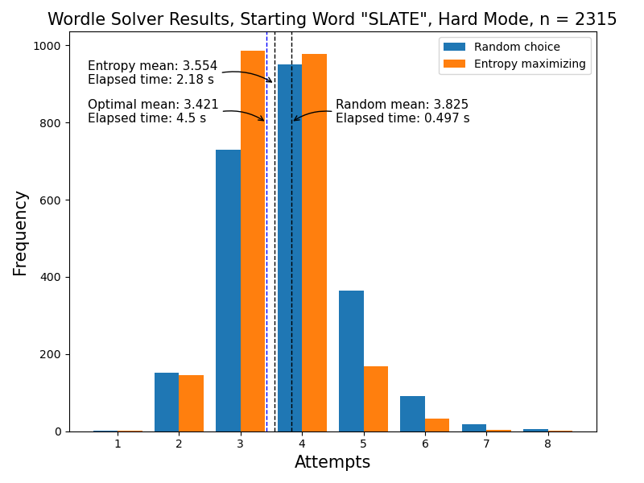
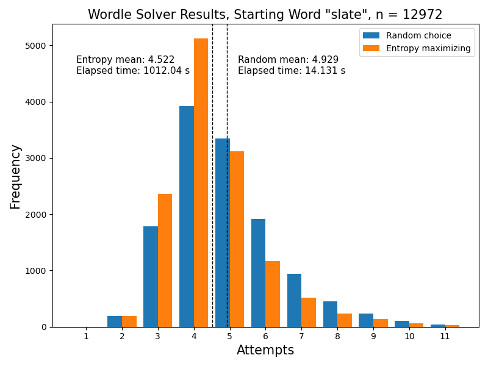

# C++ Wordle Solver

Basic Wordle solver that uses some information theory to try to optimise the number of guesses required. Currently supports only a simple command-line interface. Work in progress.

## Usage
Compilation:

`g++ -O2 main.cpp -o main`

The program only takes one argument, the word file or a path to that file:

`./main <filename/path>`

Once running, the program will prompt you for your guess, to which you enter your 5 letter guess:

`Enter guess: ` (e.g. slate)

Then, the program will prompt you for the result:

`Enter result string: ` (e.g. ybgbb)

Enter a 5 letter string containing the following:
* `b` if the box is black (wrong letter).
* `y` if the box is yellow (wrong position).
* `g` if the box is green (correct letter and position).

The program then tells you how many possible words remain, together with what to try:

`Words remaining: 13`\
`Try: brash`

And the process repeats until a solution is found.

## Results
Compared to randomly picking from the remaining words, the method of choosing the word which generates the highest word distribution entropy performs slightly better (~9%). However, this comes at a price of a slower execution time (~5x slower). The word list used here contains all the possible Wordle answers, but not all the possible guesses.

When going through the list of every possible guess, the difference in speed is much greater (~23x slower) while the difference in performance is slightly better (~11%). 

