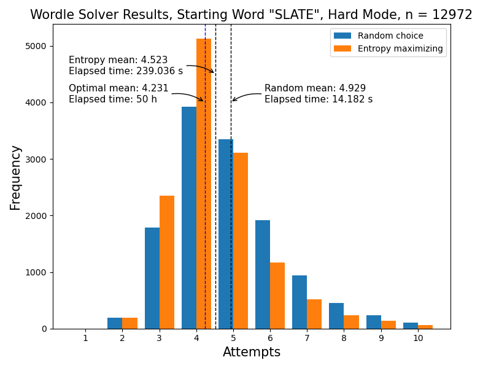

# C++ Wordle Solver

Basic Wordle solver that uses some information theory to try to optimize the number of guesses required. Currently supports only a simple command-line interface. 

## Usage
Compilation:

`g++ -O3 main.cpp -o main`

The program only takes one argument, the word file or a path to that file:

`./main <filename/path>`

Once running, the program will prompt you for your guess, to which you enter your 5 letter guess:

`Enter guess: ` (e.g. slate)

Then, the program will prompt you for the result:

`Enter result string: ` (e.g. ybgbb)

Enter a 5 letter string containing the following:
* `b` if the box is black (wrong letter).
* `y` if the box is yellow (correct letter but wrong position).
* `g` if the box is green (correct letter and position).

The program then tells you how many possible words remain, together with what to try:

`Words remaining: 13`\
`Try: brash`

And the process repeats until a solution is found.

For the python plotters, install the necessary modules if they are missing:

`pip install matplotlib numpy`

## Results
Here are the results of my strategy, which involves: 
* Picking the guess which maximizes the result distribution entropy
* Ignoring this guess if it is part of the set of `bad_guesses` and there are still more than 10 words remaining

This set of `bad_guesses = {weird, price, antic, corny, baste}` was made by first testing the entropy-maximization strategy on every word without any exclusion, then picking the first guesses that led to the total number of guesses exceeding 6.

For the 2315-words solution list, my strategy is close to the [optimal](https://www.poirrier.ca/notes/wordle-optimal/) which uses a more sophisticated method involving decision trees. With more tweaking to the `bad_guesses` set and word cutoff, my strategy can probably be improved. 

For the full-length 12972-words list however, my strategy performs a lot worse compared to the [optimal](https://www.poirrier.ca/notes/wordle-optimal/), although the computational time is much shorter. Perhaps this is due to a bad choice of `bad_guesses`.

Future developments may include updates to the strategy so that it never exceeds 6 guesses.